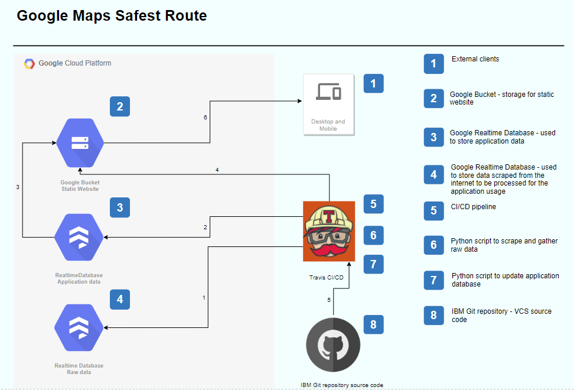

# Google Maps Safest Route
This repository contains overview documentation and project management materials
for the *Google Maps Safest Route* product.
#### In this README
- [Product Overview](#product-overview)
- [Architecture Description](#architecture-description)
- [Developer Guide](#developer-guide)
## Product Overview
*Google Maps Safest Route* is a web application that helps users visualize dangerous spots on the map and to display the distance between a given address and the respective dangerous spot. 
Users can find more information about that spots by clicking on the marker.
## Architecture Description
### Front Web aplication 
This is the interface betwen the user and the application. The user can look over the map, can zoom in and out of the map and if the user provides an address the application will generate a list with the dangerous spots and distance to that point from the provided address.
Each dangerous point displaied on the map can display more information like type of the crime, address, description, url from where the information was collected, date when the event took place, geographical coordinates and a picture of the place.
### Places info Database
That database will provide information about dangerous points and the web application will use that database.
That database will be updated with new informations. 
### Raw data Database
That database will be used to store raw data collected by the scraper script and will be used by a Natural Languade processing application to generate dangerous data points record.

### Google Maps Platform APIs
We have used Sendgrid API to send quotes to our users.
- [Find out more about Google Maps Platform APIs](https://developers.google.com/maps/documentation/javascript/tutorial)
### Firebase Realtime Database
The Firebase Realtime Database is a cloud-hosted database. Data is stored under the JSON format and synchronized in realtime to every connected client. When you build cross-platform apps with our iOS, Android, and JavaScript SDKs, all of your clients share one Realtime Database instance and automatically receive updates with the newest data.
- [Find out more about Realtime Database](https://firebase.google.com/docs/database)
### Google Cloud 
Google Cloud Platform, offered by Google, is a suite of cloud computing services that runs on the same infrastructure that Google uses internally for its end-user products, such as Google Search, Gmail and YouTube.
Google Cloud Platform provides infrastructure as a service, platform as a service, and serverless computing environments.
Cloud computing platforms, like Google Cloud, tend to be less expensive and more secure, reliable, and flexible than on-premises servers. With the cloud, equipment downtime due to maintenance, theft, or damage is almost non-existent. You can scale your compute and storage resources—up or down—almost instantly when your needs change on Google Cloud. Also, you typically pay only for the services you use, which provides a level of convenience and cost-control that's almost impossible to achieve with on-site infrastructure.
In this project we utilize Google Cloud Storage (bucket) to deploy the static web application, Firebase Realtime Database to store data.
### IBM Github
For project development I use IBM Github for tracking changes in source code during development.
IBM Github provides hosting for software development version control using Git.
Git is a distributed version-control system for tracking changes in source code during software development. It is designed for coordinating work among programmers, but it can be used to track changes in any set of files. Its goals include speed, data integrity, and support for distributed, non-linear workflows. 
- [Find out more about Git](https://git-scm.com/)
### Travis CI / CD
Continuous Integration / Continuous Deployment will be used to support fast deployment
of new features to production, as they are developed. We have a pipeline that runs from IBM Git into Google Cloud straight to production.
Travis pipeline will be triggered when a new code version is committed.
-   Travis file 
 ```code
 language: python
python:
  - "3.6"
cache: pip
install:
  - pip install -r requirements.txt
script:
  - python scripts/searchandscrape.py
  - python scripts/UploadToRealtimePy.py
deploy:
  provider: gcs
  access_key_id: ${access_key_id}
  secret_access_key: ${secret_access_key}
  bucket: culi-data-loc
  cache_control: "no-cache"
  local-dir: sourcecode
  on:
    all_branches: true
    repo: ITT-Projects/Google-Maps-Safest-Route
 ```

- [Find out more about Travis](https://travis-ci.org/)  

### Architecture


### Environments
We have used truck based development so we just have a *production* system.

## Prerequisites
This project **requires** prerequisites in order to run.
- GitHub Account
- Google Cloud Account
- Travis Account
### Overview
Google Maps Safest Route application consists two main actions:
 - Retrieve and display information.
 
On this project I will cover the following: searching the internet, scraping raw data and finally, displaying the data on the map.
As a future activity, raw data processing can be considered in order to update the database with the latest events.
For the development of the application we used the following technologies.
- for the web application I used HTML, JavaScript and Google Maps JavaScript API
- [Find out more about HTML](https://developer.mozilla.org/en-US/docs/Web/Guide/HTML/HTML5)
- [Find out more about JavaScript](https://developer.mozilla.org/en-US/docs/Web/JavaScript)
- [Find out more about Google Maps JavaScript API](https://developers.google.com/maps/documentation/javascript/tutorial)
- for the web scraper scripts and data transfer scrips I used Python3 and the following library - Beautiful Soup, Pandas, Firebase
- [Find out more about Python 3](https://www.python.org/)
- [Find out more about Beautiful Soup](https://www.crummy.com/software/BeautifulSoup/bs4/doc/)
- [Find out more about Pandas](https://pandas.pydata.org/) 
- [Find out more about Firebase](https://pypi.org/project/python-firebase/) 


### Display a Google map centered on Dublin, Ireland
```code
   <!DOCTYPE html>
<html>
  <head>
    <title>Simple Map</title>
    <meta name="viewport" content="initial-scale=1.0">
    <meta charset="utf-8">
    <style>
      /* Always set the map height explicitly to define the size of the div
       * element that contains the map. */
      #map {
        height: 100%;
      }
      /* Optional: Makes the sample page fill the window. */
      html, body {
        height: 100%;
        margin: 0;
        padding: 0;
      }
    </style>
  </head>
  <body>
    <div id="map"></div>
    <script>
      var map;
      function initMap() {
        map = new google.maps.Map(document.getElementById('map'), {
          center: {lat: 53.349805, lng: -6.260255},
          zoom: 8
        });
      }
    </script>
    <script src="https://maps.googleapis.com/maps/api/js?key=YOUR_API_KEY&callback=initMap"
    async defer></script>
  </body>
</html>
```
### Script to search on internet for crime data and colect raw data and store in Realtime Database
```code
from urllib.request import urlopen as uReq
from bs4 import BeautifulSoup as soup
from googlesearch import search
from firebase import firebase

# fix .async issue from firebase library https://www.youtube.com/watch?v=TiMACTNbNl8
#tutorial database  https://codeloop.org/python-firebase-real-time-database/
firebase = firebase.FirebaseApplication('https://ny-sub-sta-articles.firebaseio.com/', None)
# to search
query = "irishtimes Crime in Dublin"
url = []
for j in search(query, tld="com", num=10, stop=10, pause=2):
    url.append(j)
print (url)
for my_url in url:
    try:
        uClient = uReq(my_url)
        page_html = uClient.read()
        uClient.close()
        # html parsing
        page_soup = soup(page_html, "html.parser")
        time = page_soup.find("time").get_text()
        load = page_soup.find("div", {"class": "article_bodycopy"})
        items = load.find_all("p", {"class": "no_name"})
        text = [item.get_text() for item in items]
        data = {'time': time,
                'text': text
                }
        result = firebase.post('/articles/', data )
    except:
        pass

#result2 = firebase.get('/articles/', '')
#print(result2)
```
### To try this project
- [Google Maps Safest Route](http://storage.googleapis.com/culi-data-loc/index.html) 
